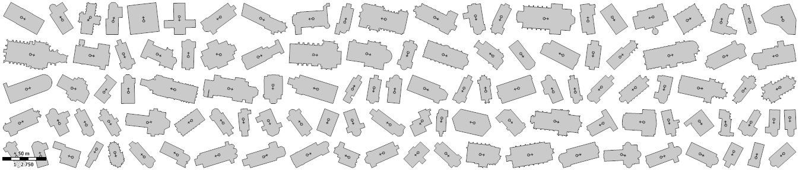

Essaye de calculer l'orientation d'une église, ajoute la valeur dans le tag "angle" de l'église et d'un centroid "amélioré" de l'église.  
Solution imparfaite, pas 100% de réussite.

Usage : python add_church_angle osmfile.osm

